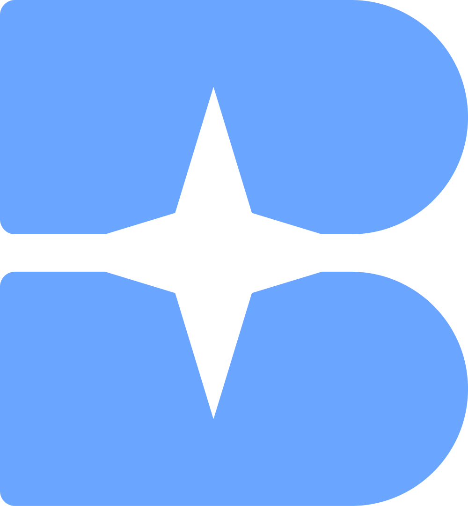
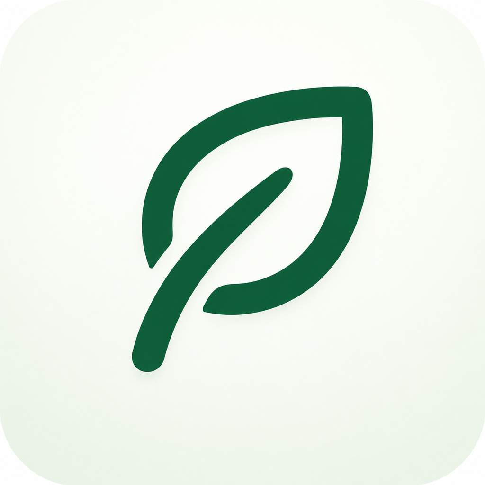

# 💻 기술스택
### 언어

### 프레임워크

### DB

# 👥 팀 프로젝트

 
# 🏆 수상
* **ASK 2025 학부생 논문경진대회 금상** `2025`
    * **주최:** 한국정보처리학회 (KIPS)
    * **분야:** 인간-컴퓨터 상호작용 (HCI)
    * **논문:** AutomationElement 기반의 UI 상호작용을 통한 사용자 패턴 분석 시스템 (KIPS_C2025A0200)
      
* **UNITHON 2025, 최우수상** `2025`
    * **대회:** 교내 연합 해커톤
    * **프로젝트:** JIRA_Extension

* **소프티어 챌린지상** `2026`
    * **대회:** HMG 부트캠프 8기 해커톤
    * **프로젝트:** mapin
 
# 🪪 자격증
* **정보처리기사(2026)**

# 🏢 경력
* **ICT 인턴십 (26.09 ~ 26.12)**
    * **이모션웨이브:** AI Agent 개발
